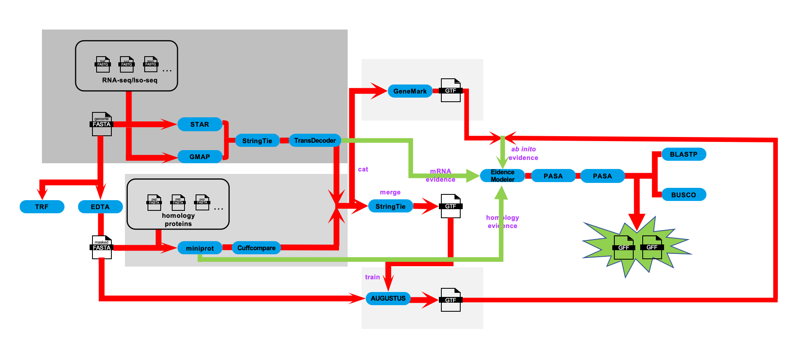

# Gene Prediction Methods

## Workflow
<p align="center">
</p>

The annotation integrated evidence from RNA-seq, Iso-seq, homologous protein alignments, and ab initio gene prediction.


Stranded RNA-seq reads were aligned to softmasked genome using STAR and assembled using StringTie:
```
STAR --runThreadN 64 --runMode genomeGenerate --genomeDir ./01_star_index/Kronos --genomeFastaFiles ../01.ref_genome/Kronos.softmask.fa --limitGenomeGenerateRAM 200000000000
STAR --runThreadN 64 \
        --genomeDir ./01_star_index/Kronos \
        --readFilesIn $(ls ../00.data/01.rna_seq/Kronos/Cleandata/*_1.clean.fq.gz | xargs | sed 's/ /,/g') $(ls ../00.data/01.rna_seq/Kronos/Cleandata/*_2.clean.fq.gz | xargs | sed 's/ /,/g') \
        --readFilesCommand zcat \
        --outFileNamePrefix ./02_star_mapping/Kronos \
        --outSAMtype BAM SortedByCoordinate \
        --outBAMsortingThreadN 64 \
        --outSAMattrIHstart 0 \
        --outSAMstrandField intronMotif \
        --outSAMattributes All \
        --alignIntronMin 20 \
        --alignIntronMax 20000
        
stringtie \
        -m 150 \
        -t \
        -f 0.3 \
        -p 64 \
        -l Kronos_NGS \
        --rf \
        -o 03_stringtie/Kronos_NGS.gtf \
        ./02_star_mapping/Kronos/KronosAligned.sortedByCoord.out.bam
```

Iso-seq data were processed by first mapping redundant isoforms to the softmasked genome using pbmm2 (https://github.com/PacificBiosciences/pbmm2, v1.17.0), followed by collapsing into transcripts using ISO-seq (https://github.com/PacificBiosciences/IsoSeq, v4.3.0). Transcript loci were predicted by GMAP69 (v2024-11-20; -L 10000000).
```
isoseq refine ../00.data/02.iso_seq/Kronos/Kronos.bam ../00.data/02.iso_seq/primer.fa $outdir/${genome_species}_flnc.bam --require-polya -j $nt

#2) cluster
isoseq cluster2 $outdir/${genome_species}_flnc.bam $outdir/${genome_species}_transcripts.bam -j $nt

#3) pbmm2
pbmm2 index $genome $genome_dir/${genome_species}.softmask.fa.mmi
pbmm2 align --sort -J 8 -j $nt --preset ISOSEQ -G 20000 -j 20 --log-level INFO --bam-index CSI $genome_dir/${genome_species}.softmask.fa.mmi $outdir/${genome_species}_transcripts.bam $outdir/${genome_species}_pbmm2.bam

#4) collapse
isoseq collapse -j $nt --do-not-collapse-extra-5exons $outdir/${genome_species}_pbmm2.bam $outdir/${genome_species}_flnc.bam $outdir/${genome_species}_collapse.gff
echo end: "$(date "+%F %T")"

```


For coding-region prediction, transcript assemblies from RNA-seq and Iso-seq were merged using StringTie (-m 150) and passed to TransDecoder (https://github.com/TransDecoder/TransDecoder, v5.7.1, default parameters), resulting in transcriptome-derived gene annotations.


For protein homology evidence, gene structures from a diverse panel of species, including Arabidopsis thaliana (TAIR10), Sorghum bicolor (v3), Zea mays (B73 NAM V5), Oryza sativa (IRGSP-1.0.60), Secale cereale, Brachypodium distachyon (v3.0), Aegilops speltoides, Hordeum vulgare, Triticum aestivum (IWGSC v2.1), Triticum dicoccoides, Triticum turgidum (Svevo.v1), and Triticum urartu were projected onto softmasked genomes using miniprot70 (v0.12; default parameters).
Ab initio gene predictions were produced with Augustus71 (v3.5.0; --softmasking=on --genemodel=complete --alternatives-from-evidence=on) and GeneMark-ET72 (v4.72_lic). We merged the transcriptome-derived gene annotations and homology evidence using Cuffcompare and StringTie, and passed the resulting GTF file to TransDecoder to generate training data for Augustus. Augustus gene prediction was performed using a model specifically trained from the software and three hints files generated by the previously mentioned RNA-Seq, Iso-seq and homology-based predictions. GeneMark-ET was used with the option -ET, and intron coordinates were calculated using the above-mentioned RNA-Seq alignments.
All of the gene evidence from transcriptomics, protein alignments, and ab initio predictions was integrated using EvidenceModeler73 (v2.1.0; --segmentSize 100000 --overlapSize 10000), with weights assigned according to Mascher et al. 202474: transcript (merged from RNA-seq and Iso-seq, 10), homology (8), Augustus (5), and GeneMark (2). The resulting annotations were refined through two rounds of PASA (v2.5.3).
Gene models were classified as high confidence (HC) or low confidence (LC) genes according to criteria used by the IWGSC (https://urgi.versailles.inra.fr/download/iwgsc/IWGSC_RefSeq_Annotations/v1.0/iwgsc_refseqv1.0_README.pdf) and Liu et al.48. DIAMOND (v2.1.8) was used to compare predicted protein sequences against three curated datasets: UniMag (38,182 reviewed Magnoliopsida proteins, downloaded from Uniprot (SwissProt), June 2025), UniPoa (2,848,452 Poaceae proteins downloaded from Uniprot (SwissProt and trEMBL), June 2025), and PTREP (https://trep-db.uzh.ch/index.php, Rel-19, June 2025). Protein-encoding gene models were considered complete when start and stop codons were present. A HC protein sequence is complete with a hit in the UniMag database (HC1), or with hits in UniPoa and not in TREP (HC2). An LC protein sequence is incomplete and has a hit in the UniMag (LC1) or complete gene models with no hits to any of the three databases (LC2) or incomplete gene models with hits in Poaceae protein but no hits in the TE database TREP (LC3) or incomplete gene models with no hits to any of the three databases (LC4). TREP genes have no hits to UniMag proteins but with hits to TREP entries. We also promoted gene models with intron chains supported by Iso-Seq to HC (HC3)48. InterProScan (version 5.73) was used to predict potential protein domains and perform GO annotations for HC genes of each accession with the parameters “-goterms -iprlookup -pa -dp”75.
