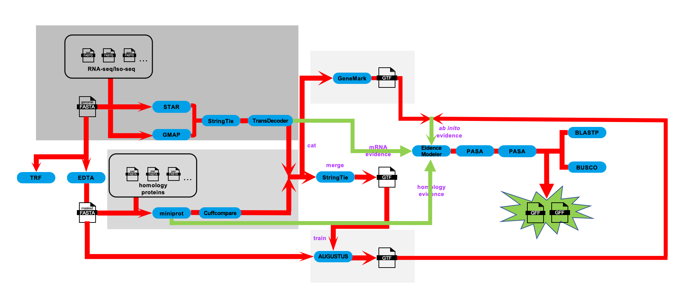

# Gene Prediction Methods

## Genome annotation
### Workflow
<p align="center">
</p>

The annotation integrated evidence from RNA-seq, Iso-seq, homologous protein alignments, and ab initio gene prediction.

### Annotation
Stranded RNA-seq reads were aligned to softmasked genome using STAR and assembled using StringTie:
```
STAR --runThreadN 64 --runMode genomeGenerate --genomeDir ./01_star_index/Kronos --genomeFastaFiles ../01.ref_genome/Kronos.softmask.fa --limitGenomeGenerateRAM 200000000000
STAR --runThreadN 64 \
        --genomeDir ./01_star_index/Kronos \
        --readFilesIn $(ls ../00.data/01.rna_seq/Kronos/Cleandata/*_1.clean.fq.gz | xargs | sed 's/ /,/g') $(ls ../00.data/01.rna_seq/Kronos/Cleandata/*_2.clean.fq.gz | xargs | sed 's/ /,/g') \
        --readFilesCommand zcat \
        --outFileNamePrefix ./02_star_mapping/Kronos \
        --outSAMtype BAM SortedByCoordinate \
        --outBAMsortingThreadN 64 \
        --outSAMattrIHstart 0 \
        --outSAMstrandField intronMotif \
        --outSAMattributes All \
        --alignIntronMin 20 \
        --alignIntronMax 20000
        
stringtie \
        -m 150 \
        -t \
        -f 0.3 \
        -p 64 \
        -l Kronos_NGS \
        --rf \
        -o 03_stringtie/Kronos_NGS.gtf \
        ./02_star_mapping/Kronos/KronosAligned.sortedByCoord.out.bam
```

Iso-seq data were processed by first mapping redundant isoforms to the softmasked genome using pbmm2 (https://github.com/PacificBiosciences/pbmm2, v1.17.0), followed by collapsing into transcripts using ISO-seq (https://github.com/PacificBiosciences/IsoSeq, v4.3.0).
```
isoseq refine ../00.data/02.iso_seq/Kronos/Kronos.bam ../00.data/02.iso_seq/primer.fa ./01_isoseq_prep/Kronos/Kronos_flnc.bam --require-polya -j 64
isoseq cluster2 ./01_isoseq_prep/Kronos/Kronos_flnc.bam ./01_isoseq_prep/Kronos/Kronos_transcripts.bam -j 64
pbmm2 index ../01.ref_genome/Kronos.softmask.fa ../01.ref_genome/Kronos.softmask.fa.mmi
pbmm2 align --sort -J 8 -j 64 --preset ISOSEQ -G 20000 -j 20 --log-level INFO --bam-index CSI ../01.ref_genome/Kronos.softmask.fa.mmi ./01_isoseq_prep/Kronos/Kronos_transcripts.bam ./01_isoseq_prep/Kronos/Kronos_pbmm2.bam
isoseq collapse -j 64 --do-not-collapse-extra-5exons ./01_isoseq_prep/Kronos/Kronos_pbmm2.bam ./01_isoseq_prep/Kronos/Kronos_flnc.bam ./01_isoseq_prep/Kronos/Kronos_collapse.gff
```

Transcript loci were predicted by GMAP (v2024-11-20).
```
gmap_build -D ./02_gmap_index/Kronos -d Kronos -t 64 ../01.ref_genome/Kronos.softmask.fa
# gff
gmapl \
        -D ./02_gmap_index/Kronos \
        -d Kronos \
        -L 10000000 \
        -f 2 \
        --nthreads 64 \
         ../01_isoseq_prep/Kronos/Kronos_collapse.fasta \
        > ./Kronos_isoseq_gmap.gff
# psl
gmapl \
        -D ../02_gmap_index/Kronos \
        -d  Kronos\
        -L 10000000 \
        -f 1 \
        --nthreads 64 \
        ../01_isoseq_prep/Kronos/Kronos_collapse.fasta \
        > ../03_gmap_mapping/Kronos/Kronos_isoseq_gmap.psl

# Convert the output of GMAP to hints for AUGUSTUS
cat ../03_gmap_mapping/Kronos/Kronos_isoseq_gmap.psl | sort -n -k 16,16 | sort -s -k 14,14 | perl -ne '@f=split; print if ($f[0]>=100)' \
        | blat2hints.pl --source=PB --nomult --ep_cutoff=20 --in=/dev/stdin --out=../03_gmap_mapping/Kronos/Kronos_isoseq_gmap.hints.gff
        
```

For coding-region prediction, transcript assemblies from RNA-seq and Iso-seq were merged using StringTie and passed to TransDecoder (https://github.com/TransDecoder/TransDecoder, v5.7.1), resulting in transcriptome-derived gene annotations.
```
 /home/yangg/software/anaconda3/envs/gene/bin/stringtie \
        --merge \
        -G ../02.rna_seq/03_stringtie/Kronos/Kronos_NGS.gtf \
        -m 150 \
        -l Kronos_Ngs_Iso \
        -o ./01_merge_and_transdecoder/Kronos_transcriptome_merge_evidence.gtf \
        ../03.iso_seq/03_gmap_mapping/Kronos/Kronos_isoseq_gmap.gff

gtf_genome_to_cdna_fasta.pl Kronos_transcriptome_merge_evidence.gtf ../01.ref_genome/Kronos.softmask.fa > Kronos_transcriptome_merge_evidence.cds.fa
gtf_to_alignment_gff3.pl Kronos_transcriptome_merge_evidence.gtf > Kronos_transcriptome_merge_evidence.alignment.gff3
TransDecoder.LongOrfs -t Kronos_transcriptome_merge_evidence.cds.fa
TransDecoder.Predict -t Kronos_transcriptome_merge_evidence.cds.fa
cdna_alignment_orf_to_genome_orf.pl \
        Kronos_transcriptome_merge_evidence.cds.fa.transdecoder.gff3 \
        Kronos_transcriptome_merge_evidence.alignment.gff3 \
        Kronos_transcriptome_merge_evidence.cds.fa \
        > Kronos_transcriptome_merge_evidence.transdecoder.gff        
```


For protein homology evidence, gene structures from a diverse panel of species, including Arabidopsis thaliana (TAIR10), Sorghum bicolor (v3), Zea mays (B73 NAM V5), Oryza sativa (IRGSP-1.0.60), Secale cereale, Brachypodium distachyon (v3.0), Aegilops speltoides, Hordeum vulgare, Triticum aestivum (IWGSC v2.1), Triticum dicoccoides, Triticum turgidum (Svevo.v1), and Triticum urartu were projected onto softmasked genomes using miniprot (v0.12).
```
miniprot -t 64 -d ./01_miniport_index/Kronos/Kronos.mpi ../01.ref_genome/Kronos.softmask.fa
while read -r homo_species_pep;
do
    homo_species_basename=$(basename $homo_species_pep)
    homo_species_name=${homo_species_basename%*.pep}
    miniprot -t 64 -I --gtf ./01_miniport_index/Kronos/Kronos.mpi $homo_species_pep > ./02_miniprot_mapping/Kronos/Kronos.miniport.gtf
    miniprot -t 64 -I --gff -P $homo_species_name ./01_miniport_index/Kronos/Kronos.mpi $homo_species_pep > ./02_miniprot_mapping/Kronos/Kronos.miniport.gff
echo "[INFO: $(date "+%F %T")]: $homo_species_name finished."
done < <(cat homo_species_pep.list)

cat ./02_miniprot_mapping/Kronos/*.miniport.gff |awk -v FS="\t" 'NR==1{print $0}NR>1{if($1!~/^##gff-version/ && $1!~/^##PAF/){print $0}}' > ./02_miniprot_mapping/Kronos/Kronos_miniport.combine.gff
cat ./02_miniprot_mapping/Kronos/*.miniport.gff |awk -v FS="\t" 'NR==1{print $0}NR>1{if($1!~/^##gff-version/){print $0}}' > ./02_miniprot_mapping/Kronos/Kronos_miniport.combine.paf.gff

find ./02_miniprot_mapping/Kronos -name "*.miniport.gtf" -type f |sort > ./03_miniprot_aln2hints/Kronos/Kronos_homo_species_miniprot.gtf.list
while read -r homo_species_gtf;
do
homo_species_basename=$(basename $homo_species_gtf)
homo_species_name=${homo_species_basename%*.miniport.gtf}
aln2hints.pl \
        --in $homo_species_gtf \
        --out ./03_miniprot_aln2hints/Kronos/Kronos.hints.gff \
        --prg=miniprot \
        --minintronlen=20 \
        --maxintronlen=20000
done < <(cat ./03_miniprot_aln2hints/Kronos/Kronos_homo_species_miniprot.gtf.list)
cat $(ls ./03_miniprot_aln2hints/Kronos/*.hints.gff) > ./03_miniprot_aln2hints/Kronos/Kronos_homology_combined_hints.gff
```

Ab initio gene predictions were produced with Augustus (v3.5.0; ) and GeneMark-ET72 (v4.72_lic). We merged the transcriptome-derived gene annotations and homology evidence using Cuffcompare and StringTie, and passed the resulting GTF file to TransDecoder to generate training data for Augustus. 
```
cd ./01_abinitio_prep/Kronos
find $(cd ../../../05.homo_evidence/02_miniprot_mapping/Kronos; pwd) -name "*miniport.gtf" -type f |sort > homo_species_miniprot.gtf.list

cuffcompare \
        -r ../../../04.transcript_evidence/01_merge_and_transdecoder/Kronos/Kronos_transcriptome_merge_evidence.transdecoder.gff \
        -s ../../../01.ref_genome/Kronos.softmask.fa \
        -o Transcript_Homo_compare \
        -i homo_species_miniprot.gtf.list

stringtie \
        --merge \
        -G  ../../../04.transcript_evidence/01_merge_and_transdecoder/Kronos/Kronos_transcriptome_merge_evidence.transdecoder.gff \
        -m 150 \
        -l Ngs_Iso_Homo \
        -o transcriptome_homology_merge_evidence.gtf \
        Transcript_Homo_compare.combined.gtf

gtf_genome_to_cdna_fasta.pl transcriptome_homology_merge_evidence.gtf ../../../01.ref_genome/Kronos.softmask.fa > transcriptome_homology_merge_evidence.cdna.fa
gtf_to_alignment_gff3.pl transcriptome_homology_merge_evidence.gtf > transcriptome_homology_merge_evidence.alignment_gff.tsv
TransDecoder.LongOrfs -t transcriptome_homology_merge_evidence.cdna.fa
TransDecoder.Predict -t transcriptome_homology_merge_evidence.cdna.fa
cdna_alignment_orf_to_genome_orf.pl \
        transcriptome_homology_merge_evidence.cdna.fa.transdecoder.gff3 \
        transcriptome_homology_merge_evidence.alignment_gff.tsv \
        transcriptome_homology_merge_evidence.cdna.fa \
        > transcriptome_homology_merge_evidence.gff
        
```

GeneMark-ET was used with the option -ET, and intron coordinates were calculated using the above-mentioned RNA-Seq alignments.
```
cd ./02_genemark_ET/Kronos
ln -s ../../02.rna_seq/02_star_mapping/Kronos/KronosSJ.out.tab .
star_to_gff.pl --star KronosSJ.out.tab --gff Kronos_star_SJ.gff --label Kronos
gmes_petap.pl --ET Kronos_star_SJ.gff --cores 64 --debug --sequence ../../01.ref_genome/Kronos.softmask.fa
        
```

Augustus gene prediction was performed using a model specifically trained from the software and three hints files generated by the previously mentioned RNA-Seq, Iso-seq and homology-based predictions. 
```

cd ./03_augustusTrain/Kronos
#1) Convert GFF file and sequence fasta file to minimal genbank format
gff2gbSmallDNA.pl ./01_abinitio_prep/Kronos/transcriptome_homology_merge_evidence.gff ../../01.ref_genome/Kronos.softmask.fa 1000 Kronos.gb
#2) Training
etraining --species=generic --stopCodonExcludedFromCDS=false Kronos.gb 2> Kronos_etrain.err
#3) Get sequences containing errors
cat Kronos_etrain.err | perl -pe 's/.*in sequence (\S+): .*/$1/' > Kronos_badgenes.list
#4) Filter erroneous sequences

filterGenes.pl Kronos_badgenes.list Kronos.gb > Kronos.new.gb
#5) Extract qualified protien IDs and their corresponding peptide sequences
grep '/gene' Kronos.new.gb | sort | uniq | sed 's/\/gene=//g' |sed 's/\"//g' | awk '{print $1}' > Kronos_geneSet.list
gffread ./01_abinitio_prep/Kronos/transcriptome_homology_merge_evidence.gff -g ../../01.ref_genome/Kronos.softmask.fa -y Kronos_predict.pep
seqkit grep -f Kronos_geneSet.list Kronos_predict.pep > Kronos_geneSet.pep.fa


perl Kronos_goodgenes.gff.pl

makeblastdb -in Kronos_geneSet.pep.fa -dbtype prot -parse_seqids -out Kronos_geneSet.pep.fa
blastp -db Kronos_geneSet.pep.fa -query Kronos_geneSet.pep.fa -out Kronos_geneSet.pep.blastp.m8 -evalue 1e-5 -outfmt 6 -num_threads 8
python ./delete_high_identity_gene.py Kronos_goodgenes.gff Kronos_geneSet.pep.blastp.m8 0.7 Kronos_nonredundant_pep.gff

#####
gff2gbSmallDNA.pl Kronos_nonredundant_pep.gff $genome 1000 Kronos_for_train.gb
randomSplit.pl Kronos_for_train.gb 200
new_species.pl --species=Kronos.v14aug
etraining --species=Kronos.v14aug Kronos_for_train.gb.train
augustus --species=Kronos.v14aug Kronos_for_train.gb.test > Kronos_firsttest.out

cp Kronos_for_train.gb.train Kronos_optimize.gb
randomSplit.pl Kronos_optimize.gb 300
optimize_augustus.pl --species=Kronos Kronos_optimize.gb.test --onlytrain=Kronos_optimize.gb.train --cpus=18
etraining --species=Kronos Kronos_optimize.gb
augustus --species=Kronos Kronos_for_train.gb.test > secondtest.out


# Preparation
cat ../05.homo_evidence/03_miniprot_aln2hints/Kronos/Kronos_homology_combined_hints.gff \
       ../02.rna_seq/04_bam2hints/Kronos/Kronos_NGS.hints.gff \
       ../03.iso_seq/03_gmap_mapping/Kronos/Kronos_isoseq_gmap.hints.gff \
       > ./04.augustusPredict.allhints/Kronos_Ngs_Iso_Homology.combined_hints.gff
 
cd ./04.augustusPredict.allhints/Kronos

find ../../../01.ref_genome/Kronos.softmask -name "*.softmask.part_*.fa" -type f |sort -V > Kronos_chrom_fa.list
sed -r -e 's@.*.softmask.part_(\w+).fa@\1@' Kronos_chrom_fa.list > Kronos_chrom.list
ulimit -u 40960
while read -r chrom;
do
awk -v FS="\t" -v OFS="\t" -v CHROM=$chrom '$1 == CHROM' Kronos_Ngs_Iso_Homology.combined_hints.gff > Kronos_Ngs_Iso_Homology.combined_hints.${chrom}.gff
# augustus with all hints (RNA-Seq+Iso-Seq+homology)
/usr/bin/time augustus --AUGUSTUS_CONFIG_PATH=/home/AUGUSTUS/config \    # here is the path to the augustus software
    --species=Kronos \
    --softmasking=on \
    --exonnames=on \
    --codingseq=on \
    --extrinsicCfgFile=../../extrinsic.cfg \
    --genemodel=complete \
    --hintsfile=Kronos_Ngs_Iso_Homology.combined_hints.${chrom}.gff \
    --gff3=on \
    --uniqueGeneId=true \
    ../../../01.ref_genome/Kronos.softmask/Kronos.softmask.part_${chrom}.fa \
    > Kronos_augustus.allhints.${chrom}.gff
done < <(cat Kronos_chrom.list |sed -n -e '1,$p')

cat $(ls Kronos_augustus.allhints.*.gff) |grep -v '#' > Kronos_augustus.allhints.combine.gff


```


All of the gene evidence from transcriptomics, protein alignments, and ab initio predictions was integrated using EvidenceModeler (v2.1.0), with weights assigned: transcript (merged from RNA-seq and Iso-seq, 10), homology (8), Augustus (5), and GeneMark (2). 

```

cd ./01.evm/Kronos/
cp ../../weights.txt ./

#1) Homology-based evidence
ln -s -f ../../../05.homo_evidence/02_miniprot_mapping/Kronos/Kronos_miniport.combine.paf.gff .
$SOFT/EVidenceModeler-v2.1.0/EvmUtils/misc/miniprot_GFF_2_EVM_GFF3.py Kronos_miniport.combine.paf.gff > Kronos_miniport.combine.paf.evm.gff
$SOFT/EVidenceModeler-v2.1.0/EvmUtils/gff3_gene_prediction_file_validator.pl Kronos_miniport.combine.paf.evm.gff
#2) Transcript-based evidence
ln -s -f ../../../04.transcript_evidence/01_merge_and_transdecoder/Kronos/Kronos_transcriptome_merge_evidence.transdecoder.gff .
#3) Ab initio-based evidence
# GeneMark
$SOFT/EVidenceModeler-v2.1.0/EvmUtils/misc/GeneMarkHMM_GTF_to_EVM_GFF3.pl \
    ../../../06.ab_initio_evidence/02_genemark_ET/Kronos/genemark.gtf > Kronos_genemark.evm.gff
# augustus
$SOFT/EVidenceModeler-v2.1.0/EvmUtils/misc/augustus_GFF3_to_EVM_GFF3.pl \
    ../../../06.ab_initio_evidence/04.augustusPredict.allhints/Kronos/Kronos_augustus.allhints.combine.gff \
    > Kronos_augustus.allhints.combine.evm.gff
cat Kronos_genemark.evm.gff Kronos_augustus.allhints.combine.evm.gff > Kronos_allpredict.allhints.evm.gff

$SOFT/EVidenceModeler-v2.1.0/EVidenceModeler \
        --sample_id Kronos \
        --genome ../../../01.ref_genome/Kronos.softmask.fa \
        --weights weights.txt  \
        --gene_predictions Kronos_allpredict.allhints.evm.gff \
        --protein_alignments  Kronos_miniport.combine.paf.evm.gff \
                --transcript_alignments Kronos_transcriptome_merge_evidence.transdecoder.gff \
        --exec_dir Kronos \
        --segmentSize 5000000 --overlapSize 1000000 --CPU 64
```
The resulting annotations were refined through two rounds of PASA (v2.5.3).
```
cd ./01.pasa_clean/Kronos
find ../../../01.ref_genome/Kronos.softmask -name "*.softmask.part_*.fa" -type f |sort -V > Kronos_chrom_fa.list
sed -r -e 's@.*.softmask.part_(\w+).fa@\1@' Kronos_chrom_fa.list > Kronos_chrom.list
while read -r chrom;
do
awk -F'\t' -v CHROM=$chrom '$1 == CHROM' ../../../04.transcript_evidence/01_merge_and_transdecoder/Kronos/Kronos_transcriptome_merge_evidence.transdecoder.gff > Kronos_transcriptome_merge_evidence.transdecoder.${chrom}.gff

gffread Kronos_transcriptome_merge_evidence.transdecoder.${chrom}.gff -g ../../../01.ref_genome/Kronos.softmask/Kronos.softmask.part_${chrom}.fa -w Kronos_transcriptome_merge_evidence.transdecoder.spliced_transcript.${chrom}.fa

/usr/bin/time /home/yangg/software/PASApipeline.v2.5.3/bin/seqclean Kronos_transcriptome_merge_evidence.transdecoder.spliced_transcript.${chrom}.fa -v /data/lfy/UniVec/UniVec
echo "[INFO: $(date "+%F %T")]: Kronos_${chrom} finished."
done < <(cat Kronos_chrom.list)


cd ./02.pasa_align_asm/Kronos
find ../../../01.ref_genome/Kronos.softmask -name "*.softmask.part_*.fa" -type f |sort -V > Kronos_chrom_fa.list
sed -r -e 's@.*.softmask.part_(\w+).fa@\1@' Kronos_chrom_fa.list > Kronos_chrom.list
while read -r chrom;
do
cp ../../pasa.alignAssembly.txt pasa.alignAssembly.${chrom}.txt
sed -i -e "s@T2v2@Kronos/Kronos_${chrom}@" pasa.alignAssembly.${chrom}.txt
/usr/bin/time /data/lfy/biosoft/PASApipeline/Launch_PASA_pipeline.pl \
        -c pasa.alignAssembly.${chrom}.txt \
    -C \
        -r \
    -R \
    -g ../../../01.ref_genome/Kronos.softmask/Kronos.softmask.part_${chrom}.fa \
    -t ../../../01.pasa_clean/Kronos/Kronos_transcriptome_merge_evidence.transdecoder.spliced_transcript.${chrom}.fa.clean \
    -T \
    -u ../../../01.pasa_clean/Kronos/Kronos_transcriptome_merge_evidence.transdecoder.spliced_transcript.${chrom}.fa \
    --ALIGNERS blat,gmap,minimap2 \
    --CPU 64
echo "[INFO: $(date "+%F %T")]: Kronos_${chrom} finished."
done < <(cat Kronos_chrom.list)


cd ./03.pasa_annot_update.round1/Kronos
find ../../../01.ref_genome/Kronos.softmask -name "*.softmask.part_*.fa" -type f |sort -V > Kronos_chrom_fa.list
sed -r -e 's@.*.softmask.part_(\w+).fa@\1@' Kronos_chrom_fa.list > Kronos_chrom.list
/PASApipeline/misc_utilities/pasa_gff3_validator.pl ../../../07.evm/01.evm/Kronos/Kronos.EVM.gff3

while read -r chrom;
do
# Preparation
cp ../../pasa.alignAssembly.txt pasa.alignAssembly.${chrom}.txt
sed -i -e "s@T2v2@Kronos/Kronos_${chrom}@" pasa.alignAssembly.${chrom}.txt
cp ../../pasa.annotationCompare.txt pasa.annotationCompare.${chrom}.txt
sed -i -e "s@T2v2@Kronos/Kronos_${chrom}@" pasa.annotationCompare.${chrom}.txt
ln -s -f ../../../01.ref_genome/Kronos.softmask/Kronos.softmask.part_${chrom}.fa .
awk -F'\t' -v chrom=$chrom '$1==chrom' /work/songbaoxing/yangg/chenb/07.evm/01.evm/Kronos/Kronos.EVM.gff3 > Kronos.EVM.${chrom}.gff3

# Run PASA
$SOFT/PASApipeline/scripts/Load_Current_Gene_Annotations.dbi \
        -c pasa.alignAssembly.${chrom}.txt \
        -g Kronos.softmask.part_${chrom}.fa \
        -P Kronos.EVM.${chrom}.gff3
$SOFT/PASApipeline/Launch_PASA_pipeline.pl \
        -c pasa.annotationCompare.${chrom}.txt \
        -A \
        -g Kronos.softmask.part_${chrom}.fa \
        -t ../../01.pasa_clean/Kronos/Kronos_transcriptome_merge_evidence.transdecoder.spliced_transcript.${chrom}.fa.clean \
        --CPU $((nt))
echo "[INFO: $(date "+%F %T")]: Kronos_${chrom} finished."
done < <(cat Kronos_chrom.list)


cd ./03.pasa_annot_update.round2/Kronos
find ../../../01.ref_genome/Kronos.softmask -name "*.softmask.part_*.fa" -type f |sort -V > Kronos_chrom_fa.list
sed -r -e 's@.*.softmask.part_(\w+).fa@\1@' Kronos_chrom_fa.list > Kronos_chrom.list

while read -r chrom;
do
#Setup
# Preparation
cp ../../pasa.alignAssembly.txt pasa.alignAssembly.${chrom}.txt
sed -i -e "s@T2v2@Kronos/Kronos_${chrom}@" pasa.alignAssembly.${chrom}.txt
cp ../../pasa.annotationCompare.txt pasa.annotationCompare.${chrom}.txt
sed -i -e "s@T2v2@Kronos/Kronos_${chrom}@" pasa.annotationCompare.${chrom}.txt
ln -s -f ../../../01.ref_genome/Kronos.softmask/Kronos.softmask.part_${chrom}.fa .

# Run PASA
$SOFT/PASApipeline/scripts/Load_Current_Gene_Annotations.dbi \
        -c pasa.alignAssembly.${chrom}.txt \
        -g Kronos.softmask.part_${chrom}.fa \
        -P ../../03.pasa_annot_update.round1/Kronos/Kronos_${chrom}.gene_structures_post_PASA_updates.gff3
$SOFT/PASApipeline/Launch_PASA_pipeline.pl \
        -c pasa.annotationCompare.${chrom}.txt \
        -A \
        -g Kronos.softmask.part_${chrom}.fa \
        -t ../../01.pasa_clean/Kronos/Kronos_transcriptome_merge_evidence.transdecoder.spliced_transcript.${chrom}.fa.clean \
        --CPU 64
done < <(cat Kronos_chrom.list)


```

## Classifying annotations
Gene models were classified as high confidence (HC) or low confidence (LC) genes according to criteria used by the IWGSC (https://urgi.versailles.inra.fr/download/iwgsc/IWGSC_RefSeq_Annotations/v1.0/iwgsc_refseqv1.0_README.pdf) and Liu et al.48. 

DIAMOND (v2.1.8) was used to compare predicted protein sequences against three curated datasets: UniMag (38,182 reviewed Magnoliopsida proteins, downloaded from Uniprot (SwissProt), June 2025), UniPoa (2,848,452 Poaceae proteins downloaded from Uniprot (SwissProt and trEMBL), June 2025), and PTREP (https://trep-db.uzh.ch/index.php, Rel-19, June 2025). Protein-encoding gene models were considered complete when start and stop codons were present. A HC protein sequence is complete with a hit in the UniMag database (HC1), or with hits in UniPoa and not in TREP (HC2). An LC protein sequence is incomplete and has a hit in the UniMag (LC1) or complete gene models with no hits to any of the three databases (LC2) or incomplete gene models with hits in Poaceae protein but no hits in the TE database TREP (LC3) or incomplete gene models with no hits to any of the three databases (LC4). TREP genes have no hits to UniMag proteins but with hits to TREP entries. We also promoted gene models with intron chains supported by Iso-Seq to HC (HC3)48. InterProScan (version 5.73) was used to predict potential protein domains and perform GO annotations for HC genes of each accession with the parameters “-goterms -iprlookup -pa -dp”75.
```
mkdir 01.Kronos.diamond_Kronos
gffread ../06_rename/final.Kronos.gff3 -g ../../01.ref_genome/Kronos.softmask.fa -y Kronos_v1.pep -x Kronos.cds

cat ./Kronos_v1.pep | sed -E '~s/\.$//g' | sed -E '~s/([A-Z])\.([A-Z])/\1*\2/g' > Kronos.pep

diamond blastp -q ./Kronos.pep -d ../00_homo_database/te.dmnd --threads 128 --outfmt 6 qseqid sseqid length qlen qstart qend slen sstart send pident gapopen mismatch evalue bitscore --sensitive -e 1e
-5 -o ./01.Kronos.diamond_Kronos/t2_to_te.blast
diamond blastp -q ./Kronos.pep -d ../00_homo_database/buscopoales.dmnd --threads 128 --outfmt 6 qseqid sseqid length qlen qstart qend slen sstart send pident gapopen mismatch evalue bitscore --sensit
ive -e 1e-5 -o ./01.Kronos.diamond_Kronos/t2_to_buscopoales.blast
diamond blastp -q ./Kronos.pep -d ../00_homo_database/unimag.dmnd --threads 128 --outfmt 6 qseqid sseqid length qlen qstart qend slen sstart send pident gapopen mismatch evalue bitscore --sensitive -
e 1e-10 -o ./01.Kronos.diamond_Kronos/t2_to_unimag.blast
diamond blastp -q ./Kronos.pep -d ../00_homo_database/unipoa.dmnd --threads 128 --outfmt 6 qseqid sseqid length qlen qstart qend slen sstart send pident gapopen mismatch evalue bitscore --sensitive -
e 1e-10 -o ./01.Kronos.diamond_Kronos/t2_to_unipoa.blast

perl ../checkAnnotationCompleteness.pl ./Kronos.cds | sort | uniq > 01.Kronos.diamond_Kronos/ConservedFunction.list

cat ./01.Kronos.diamond_Kronos/t2_to_unimag.blast | gawk '{if(($3/$4>=0.9 && $7/$4>=0.9)&&$13<=1e-10)print $1}' | sort | uniq > 01.Kronos.diamond_Kronos/high_confidence_P1.hits1
cat ./01.Kronos.diamond_Kronos/t2_to_buscopoales.blast | gawk '{if(($3/$4>=0.7)&&$13<=1e-5)print $1}' | sort | uniq >> 01.Kronos.diamond_Kronos/high_confidence_P1.hits1
cat 01.Kronos.diamond_Kronos/high_confidence_P1.hits1 | sort | uniq > 01.Kronos.diamond_Kronos/high_confidence_P1.hits
cat ./01.Kronos.diamond_Kronos/ConservedFunction.list 01.Kronos.diamond_Kronos/high_confidence_P1.hits | sort | uniq -c | awk '$1 == 2 {print $2}' > 01.Kronos.diamond_Kronos/high_confidence_1.hits


cat ./01.Kronos.diamond_Kronos/t2_to_te.blast | gawk '{if(($3/$4>=0.70 || $7/$4>=0.70)&&$13<=1e-10)print $1}' | sort | uniq > 01.Kronos.diamond_Kronos/TE_high_confidence.hits
cat ./01.Kronos.diamond_Kronos/t2_to_unipoa.blast | gawk '{if(($3/$4>=0.9 && $7/$4>=0.9)&&$13<=1e-10&&$10>=80)print $1}' | sort | uniq > 01.Kronos.diamond_Kronos/high_confidence_unipoa.hits
wc -l 01.Kronos.diamond_Kronos/high_confidence_unipoa.hits #93154


cat ./01.Kronos.diamond_Kronos/ConservedFunction.list ./01.Kronos.diamond_Kronos/high_confidence_unipoa.hits | sort | uniq -c | awk '$1 == 2 {print $2}' > 01.Kronos.diamond_Kronos/high_confidence_unipoa_and_ConservedFunction.list
cat 01.Kronos.diamond_Kronos/high_confidence_unipoa_and_ConservedFunction.list 01.Kronos.diamond_Kronos/TE_high_confidence.hits | sort | uniq -c | awk '$1 == 2 {print $2}' > 01.Kronos.diamond_Kronos/high_confidence_unipoa_and_ConservedFunction_and_te.list
cat 01.Kronos.diamond_Kronos/high_confidence_unipoa_and_ConservedFunction_and_te.list 01.Kronos.diamond_Kronos/high_confidence_unipoa_and_ConservedFunction.list | sort | uniq -c | awk '$1 == 1 {print $2}' > ./01.Kronos.diamond_Kronos/high_confidence_2.hits
cat 01.Kronos.diamond_Kronos/high_confidence_1.hits ./01.Kronos.diamond_Kronos/high_confidence_2.hits | sort | uniq > ./01.Kronos.diamond_Kronos/t2.final.HC.id

wc -l ./01.Kronos.diamond_Kronos/t2.final.HC.id  # 100239
cat ./01.Kronos.diamond_Kronos/t2.final.HC.id | sed -E '~s/.mRNA[0-9]+//g' | sort | uniq | wc -l #83839


python3 ../summarizeGffFile/extractByTranscriptIds.py -f ../06_rename/final.Kronos.gff3 -t ./01.Kronos.diamond_Kronos/Kronos.final.HC.id > Kronos.HC.gff3
gffread Kronos.HC.gff3 -g ../../01.ref_genome/Kronos.softmask.fa -y Kronos.HC.pep
ulimit -u 5000000 -s 81920
busco -i Kronos.HC.pep -m prot -l /data/lfy/busco_od10/poales_odb10 --cpu 100 -f -o BUSCO_t2 -e 1e-05 --offline   #98.8%


# incomplete and has a hit in the UniMag
cat ./01.Kronos.diamond_Kronos/high_confidence_P1.hits ./01.Kronos.diamond_Kronos/ConservedFunction.list > ./01.Kronos.diamond_Kronos/high_confidence_P1_ConservedFunction.list
cat ./01.Kronos.diamond_Kronos/ConservedFunction.list ./01.Kronos.diamond_Kronos/high_confidence_P1_ConservedFunction.list | sort | uniq -c | awk '$1 == 1 {print $2}' > 01.Kronos.diamond_Kronos/low_confidence_1.hits
wc -l 01.Kronos.diamond_Kronos/low_confidence_1.hits # 34


# complete gene models with no hits to any of the three databases
cat 01.Kronos.diamond_Kronos/high_confidence_P1.hits 01.Kronos.diamond_Kronos/TE_high_confidence.hits 01.Kronos.diamond_Kronos/high_confidence_unipoa.hits | sort | uniq > 01.Kronos.diamond_Kronos/hit_with_anything.hits
cat ./01.Kronos.diamond_Kronos/ConservedFunction.list 01.Kronos.diamond_Kronos/hit_with_anything.hits | sort | uniq > 01.Kronos.diamond_t2/hit_with_anything_ConservedFunction.hits
cat ./01.Kronos.diamond_Kronos/hit_with_anything.hits 01.Kronos.diamond_Kronos/hit_with_anything_ConservedFunction.hits | sort | uniq -c | awk '$1 == 1 {print $2}'  > 01.Kronos.diamond_Kronos/low_confidence_2.hits
wc -l 01.Kronos.diamond_Kronos/low_confidence_2.hits # 62062


# incomplete gene models with hits in poaceae protein but no hits in the TE database TREP
cat 01.Kronos.diamond_Kronos/high_confidence_unipoa.hits 01.Kronos.diamond_Kronos/high_confidence_P1.hits | sort | uniq > 01.Kronos.diamond_Kronos/hit_anyannotation.hits
cat 01.Kronos.diamond_Kronos/hit_anyannotation.hits ./01.Kronos.diamond_Kronos/ConservedFunction.list | sort | uniq > ./01.Kronos.diamond_Kronos/hit_anyannotation_ConservedFunction.list
cat 01.Kronos.diamond_Kronos/ConservedFunction.list ./01.Kronos.diamond_Kronos/hit_anyannotation_ConservedFunction.list  | sort | uniq -c | awk '$1 == 1 {print $2}'  > ./01.Kronos.diamond_Kronos/hit_anyannotation_incomplete.list
cat 01.Kronos.diamond_Kronos/TE_high_confidence.hits ./01.Kronos.diamond_Kronos/hit_anyannotation_incomplete.list  | sort | uniq > 01.Kronos.diamond_Kronos/hit_anyannotation_incomplete_TE.list
cat 01.Kronos.diamond_Kronos/TE_high_confidence.hits 01.Kronos.diamond_Kronos/hit_anyannotation_incomplete_TE.list | sort | uniq  -c | awk '$1 == 1 {print $2}' > 01.Kronos.diamond_Kronos/low_confidence_3.hits   #01.Kronos.diamond_Kronos/hit_anyannotation_incomplete_not_TE.list
wc -l 01.Kronos.diamond_Kronos/low_confidence_3.hits  #84


# incomplete gene models with no hits to any of the three databases
grep ">" Kronos_v1.pep | sed '~s/>//g'  | awk '{print $1}' > 01.Kronos.diamond_Kronos/full.pep.list
cat ./01.Kronos.diamond_Kronos/ConservedFunction.list 01.Kronos.diamond_Kronos/full.pep.list | sort | uniq -c | awk '$1 == 1 {print $2}'  > 01.Kronos.diamond_Kronos/UnConservedFunction.hits
cat ./01.Kronos.diamond_Kronos/UnConservedFunction.hits 01.Kronos.diamond_Kronos/hit_with_anything.hits | sort | uniq > 01.Kronos.diamond_Kronos/hit_with_anything_UnConservedFunction.hits
cat ./01.Kronos.diamond_Kronos/hit_with_anything.hits 01.Kronos.diamond_Kronos/hit_with_anything_UnConservedFunction.hits | sort | uniq -c | awk '$1 == 1 {print $2}'  > 01.Kronos.diamond_Kronos/low_confidence_4.hits
wc -l 01.Kronos.diamond_Kronos/low_confidence_4.hits # 801


cat 01.Kronos.diamond_Kronos/low_confidence_1.hits 01.Kronos.diamond_Kronos/low_confidence_2.hits  01.Kronos.diamond_Kronos/low_confidence_3.hits 01.Kronos.diamond_Kronos/low_confidence_4.hits | sort | uniq >  01.Kronos.diamond_Kronos/low_confidence.hits
wc -l 01.Kronos.diamond_Kronos/low_confidence.hits #62948

cat 01.Kronos.diamond_Kronos/low_confidence.hits | sed -E '~s/.mRNA[0-9]+//g' | sort | uniq > 01.Kronos.diamond_Kronos/low_confidence_gene.list
cat ./01.Kronos.diamond_Kronos/t2.final.HC.id | sed -E '~s/.mRNA[0-9]+//g' | sort | uniq > 01.Kronos.diamond_Kronos/high_confidence_gene.list

cat 01.Kronos.diamond_Kronos/low_confidence_gene.list 01.Kronos.diamond_Kronos/high_confidence_gene.list | sort | uniq > 01.Kronos.diamond_Kronos/high_low_confidence_gene.list
cat 01.Kronos.diamond_Kronos/high_low_confidence_gene.list 01.Kronos.diamond_Kronos/high_confidence_gene.list | sort | uniq -c | awk '$1 == 1 {print $2}' > 01.Kronos.diamond_Kronos/final_low_confidence_gene.list


python3 ../02updatewithTransdecoderResults/summarizeGffFile/extractByGeneIds.py -f ../06_rename/final.Kronos.gff3 -g ./01.Kronos.diamond_Kronos/final_lo
w_confidence_gene.list > Kronos.LC.gff3


cat 01.Kronos.diamond_Kronos/TE_high_confidence.hits 01.Kronos.diamond_Kronos/high_confidence_P1.hits | sort | uniq > 01.Kronos.diamond_Kronos/TE_high_confidence_high_confidence_P1.hits
cat 01.Kronos.diamond_Kronos/TE_high_confidence_high_confidence_P1.hits 01.Kronos.diamond_Kronos/high_confidence_P1.hits | sort | uniq -c | awk '$1 == 1 {print $2}' > 01.Kronos.diamond_Kronos/TE.list
wc -l 01.Kronos.diamond_Kronos/TE.list #13052

cat 01.Kronos.diamond_Kronos/TE.list  | sed -E '~s/.mRNA[0-9]+//g' | sort | uniq > 01.Kronos.diamond_Kronos/TE.gene.list
cat 01.Kronos.diamond_Kronos/TE.gene.list 01.Kronos.diamond_Kronos/high_low_confidence_gene.list | sort | uniq > 01.Kronos.diamond_Kronos/high_low_confidence_TE_gene.list

cat 01.Kronos.diamond_Kronos/high_low_confidence_TE_gene.list 01.Kronos.diamond_Kronos/high_low_confidence_gene.list | sort | uniq -c | awk '$1 == 1 {print $2}' > 01.Kronos.diamond_Kronos/final_TE.gene.list

python3 ../02updatewithTransdecoderResults/summarizeGffFile/extractByGeneIds.py -f ../06_rename/final.Kronos.gff3 -g 01.Kronos.diamond_Kronos/final_TE.g
ene.list > Kronos.TE.gff3

wc -l 01.Kronos.diamond_Kronos/final_TE.gene.list
# 12936

wc -l 01.Kronos.diamond_Kronos/final_low_confidence_gene.list
# 60440
wc -l 01.Kronos.diamond_Kronos/high_confidence_gene.list
# 83839


#12936+60440+83839
#[1] 157215

grep ">" Kronos.pep | awk '{print $2}' | sort | uniq | wc -l
# 157215

cat 01.Kronos.diamond_Kronos/TE.list ./01.Kronos.diamond_Kronos/t2.final.HC.id 01.Kronos.diamond_Kronos/low_confidence.hits | sort | uniq -c | awk '$1 == 2 {print $0}' | head
```
